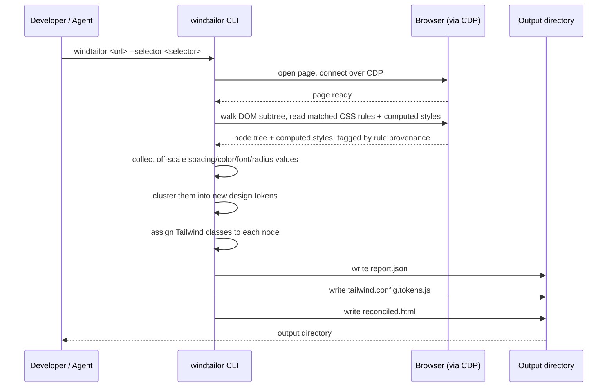

# windtailor

windtailor rewrites part of a website's front end. It reads a live webpage. It looks at one DOM node. It turns that node's real, rendered styles into Tailwind CSS classes and matching design tokens.

## What windtailor is for

windtailor is not a full rebuild tool. It is one small, repeatable step. You can run windtailor many times. Each run handles one part of a page. A human developer or an agent can call windtailor from the outside, and combine many runs into a full UI rewrite.

windtailor makes one key assumption: the page already renders correctly in a browser. windtailor reads the computed styles from that render. It does not read your source CSS or your build config.

## How it works



## Install

```sh
npm install
npm run build
```

This creates the `windtailor` command in `dist/cli.js`.

## Use

```sh
windtailor <url> --selector <css-selector> --out <output-dir>
```

- `<url>` is the page to fetch.
- `--selector` picks one DOM node on that page.
- `--out` sets where windtailor writes its output. The default is `./out`.
- `--cdp-endpoint` points windtailor at an existing CDP endpoint (e.g. Cloudflare's Kitesurf) instead of launching a local Chromium. `--cdp-header "Key: Value"` adds an auth header for that connection, and can repeat.

windtailor writes three files to the output directory:

- `report.json` — the full record of the node, its computed styles, and the classes windtailor assigned.
- `tailwind.config.tokens.js` — new design tokens for any value that did not fit Tailwind's stock scale.
- `reconciled.html` — the same node, now marked up with Tailwind classes.

## Toy example

This repo ships a small fixture page at `fixtures/simple.html`. It has one card with off-scale spacing and colors, so you can see windtailor's token clustering at work.

Run windtailor against it:

```sh
windtailor "file://$(pwd)/fixtures/simple.html" --selector "#card" --out ./out
```

Open `out/reconciled.html` to see the card rebuilt with Tailwind classes. Open `out/tailwind.config.tokens.js` to see the new radius token windtailor generated for the fixture's one off-scale value (the button's `33px` corner radius).

### Before and after

The fixture's button has hand-picked, off-scale values:

```html
<style>
  #card .cta {
    display: inline-block;
    margin-top: 14px;
    padding: 9px 17px;
    background-color: #111827;
    color: #ffffff;
    border-radius: 33px;
  }
</style>
<div class="cta">Click me</div>
```

windtailor reads the rendered result and rewrites it as Tailwind classes:

```html
<div class="py-2 px-4 rounded-33 inline-block mt-3.5 text-white bg-gray-900">Click me</div>
```

`9px 17px` padding becomes `py-2 px-4` — one class per axis, not four, since top/bottom agree and left/right agree. `#111827` becomes `bg-gray-900`. The odd `33px` radius is the same on all four corners, so it collapses to one `rounded-33` class (a new token minted just for that value) instead of four `rounded-tl-33`/`rounded-tr-33`/... duplicates.

windtailor only writes a class for a property when a real CSS rule backs it — the page's own stylesheet, or a genuine browser default like `display: block` on a `<div>`. A property nobody ever set, like this button's `position` or `width`, is left alone rather than frozen into a class. And wherever all four sides (or corners) of a box-model property agree, windtailor collapses them into Tailwind's shorter `m-`/`mx-`/`my-` (and `rounded-`/`rounded-t-`/`rounded-l-`/...) form instead of always emitting four near-duplicate classes.
