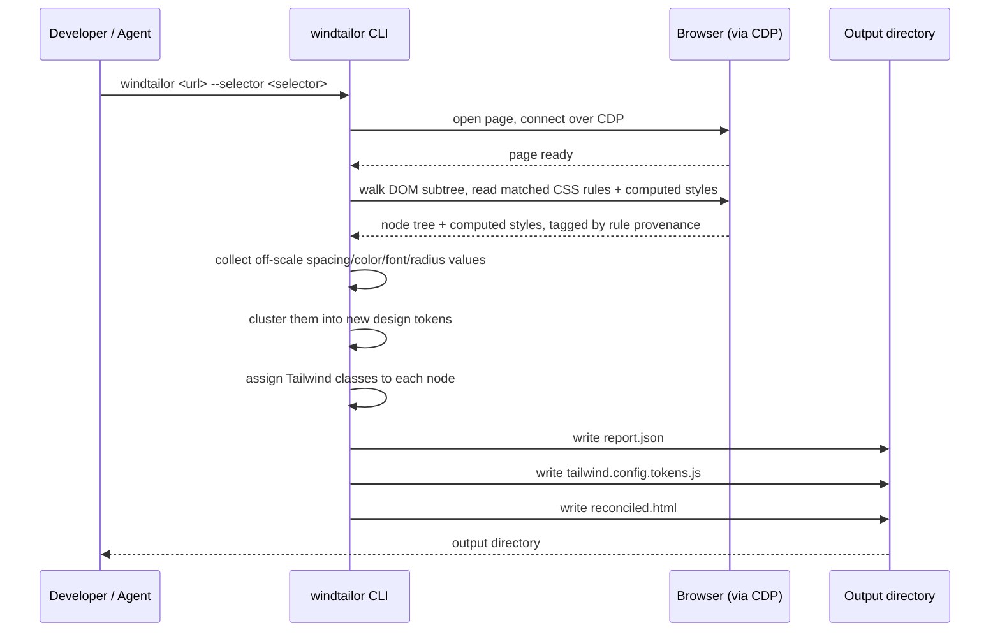
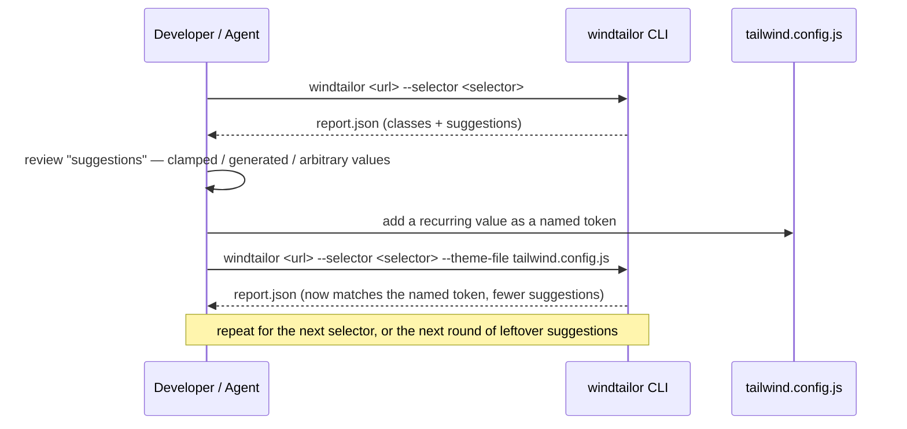

# windtailor

windtailor rewrites part of a website's front end. It reads a live webpage. It looks at one DOM node. It turns that node's real, rendered styles into Tailwind CSS classes and matching design tokens.

## What windtailor is for

windtailor is not a full rebuild tool. It is one small, repeatable step. You can run windtailor many times. Each run handles one part of a page. A human developer or an agent can call windtailor from the outside, and combine many runs into a full UI rewrite.

windtailor makes one key assumption: the page already renders correctly in a browser. windtailor reads the computed styles from that render. It does not read your source CSS or your build config.

## How it works



## Install

```sh
npm install
npm run build
```

This creates the `windtailor` command in `dist/cli.js`.

## Use

```sh
windtailor <url> --selector <css-selector> --out <output-dir>
```

- `<url>` is the page to fetch.
- `--selector` picks one DOM node on that page.
- `--out` sets where windtailor writes its output. The default is `./out`.
- `--cdp-endpoint` points windtailor at an existing CDP endpoint (e.g. Cloudflare's Kitesurf) instead of launching a local Chromium. `--cdp-header "Key: Value"` adds an auth header for that connection, and can repeat.
- `--theme-file <path>` loads a custom Tailwind theme from a `.js`/`.cjs`/`.mjs`/`.json` config file — point it at a real project `tailwind.config.js`, or a minimal file with just a `theme`/`extend` object. `--theme-json <json>` takes the same shape inline instead. Pass only one.

windtailor writes three files to the output directory:

- `report.json` — the full record of the node, its computed styles, and the classes windtailor assigned.
- `tailwind.config.tokens.js` — new design tokens for any value that did not fit Tailwind's stock scale.
- `reconciled.html` — the same node, now marked up with Tailwind classes.

## Toy example

This repo ships a small fixture page at `fixtures/simple.html`. It has one card with off-scale spacing and colors, so you can see windtailor's token clustering at work.

Run windtailor against it:

```sh
windtailor "file://$(pwd)/fixtures/simple.html" --selector "#card" --out ./out
```

Open `out/reconciled.html` to see the card rebuilt with Tailwind classes. Open `out/tailwind.config.tokens.js` to see the new radius token windtailor generated for the fixture's one off-scale value (the button's `33px` corner radius).

### Before and after

The fixture's button has hand-picked, off-scale values:

```html
<style>
  #card .cta {
    display: inline-block;
    margin-top: 14px;
    padding: 9px 17px;
    background-color: #111827;
    color: #ffffff;
    border-radius: 33px;
  }
</style>
<div class="cta">Click me</div>
```

windtailor reads the rendered result and rewrites it as Tailwind classes:

```html
<div class="py-2 px-4 rounded-33 inline-block mt-3.5 text-white bg-gray-900">Click me</div>
```

`9px 17px` padding becomes `py-2 px-4` — one class per axis, not four, since top/bottom agree and left/right agree. `#111827` becomes `bg-gray-900`. The odd `33px` radius is the same on all four corners, so it collapses to one `rounded-33` class (a new token minted just for that value) instead of four `rounded-tl-33`/`rounded-tr-33`/... duplicates.

windtailor only writes a class for a property when a real CSS rule backs it — the page's own stylesheet, or a genuine browser default like `display: block` on a `<div>`. A property nobody ever set, like this button's `position` or `width`, is left alone rather than frozen into a class. And wherever all four sides (or corners) of a box-model property agree, windtailor collapses them into Tailwind's shorter `m-`/`mx-`/`my-` (and `rounded-`/`rounded-t-`/`rounded-l-`/...) form instead of always emitting four near-duplicate classes.

### Before and after (with a custom Tailwind config)

If you run windtailor over and over against the same project, you usually want it to snap to *that project's own* design tokens, not generic Tailwind ones. `--theme-file` points windtailor at a theme — a real `tailwind.config.js`, or a minimal file like this repo's `fixtures/custom-theme.json`:

```json
{
  "extend": {
    "colors": {
      "brand-ink": "#111827",
      "brand-blue": "#3a81f5"
    },
    "borderRadius": {
      "pill": "33px"
    }
  }
}
```

Run the same button through windtailor again, this time with that file:

```sh
windtailor "file://$(pwd)/fixtures/simple.html" --selector "#card .cta" --out ./out --theme-file fixtures/custom-theme.json
```

```html
<div class="py-2 px-4 rounded-pill inline-block mt-3.5 text-white bg-brand-ink">Click me</div>
```

Same input, same page — but `bg-gray-900` became `bg-brand-ink` and `rounded-33` became `rounded-pill`. `#111827` happens to be the *exact* hex of Tailwind's own `gray-900`, so this is a real tie between the stock name and the custom one; windtailor prefers the custom theme's name when there's an exact match, since the point of pointing it at your own config is to get your own vocabulary back. And since `pill` now covers the button's radius directly, `tailwind.config.tokens.js` no longer needs to mint a new token for it at all — its `extend` comes back empty.

`--theme-file` accepts `.js`/`.cjs`/`.mjs` too (loaded the same way Tailwind's own CLI loads your config) or `--theme-json` for the same shape inline — useful when scripting many windtailor runs without a file on disk.

### Suggestions: what's worth hoisting into your theme

`report.json` also carries a `suggestions` array — one entry for every value that did not resolve cleanly, so you can see where windtailor had to compromise instead of only seeing the final class. Running the stock-theme example above produces this (trimmed to the padding and radius entries):

```json
[
  {
    "nodeId": "0",
    "property": "paddingTop",
    "category": "spacing",
    "rawValue": "9px",
    "resolvedClass": "pt-2",
    "kind": "clamped",
    "distance": 1,
    "note": "Snapped to \"pt-2\" — source value 9px was 1px off the exact scale value."
  },
  {
    "nodeId": "0",
    "property": "borderTopLeftRadius",
    "category": "radius",
    "rawValue": "33px",
    "resolvedClass": "rounded-tl-33",
    "kind": "generated",
    "note": "Minted a new token for 33px (\"rounded-tl-33\") — written to this run's tailwind.config.tokens.js, not your own config."
  }
]
```

Three kinds show up:

- `clamped` — windtailor rounded the value to the nearest stock (or custom) scale entry, within tolerance. The class is real and usable, but not exact — here, `9px` padding became `pt-2` (8px). A value that keeps clamping the same way across many runs is a sign your project actually uses `9px`, not `8px`, and might deserve its own token.
- `generated` — no scale entry was close enough, so windtailor minted a brand-new one. This is the same token that lands in the `--out` directory's `tailwind.config.tokens.js` — a standalone file, separate from any `--theme-file` you passed in. windtailor never reads from or writes to your own config; it's on you to copy the token over (or `require()` the file and spread its `extend` into yours) once you decide it's worth keeping.
- `arbitrary` — no scale entry matched at all, so the class fell back to Tailwind's raw bracket syntax (`top-[auto]`, `leading-[1.375]`). These never came from a stock or generated token, so they're the most worth a second look.

An exact match produces no entry at all — `suggestions` only lists the values that cost you something.

### Tuning windtailor over multiple runs

Since windtailor is meant to be called again and again as you rebuild a page, `suggestions` is there to close the loop: run windtailor, read what got clamped or minted, decide whether that's worth a real token in your config, and hand that config back in on the next run via `--theme-file`.


